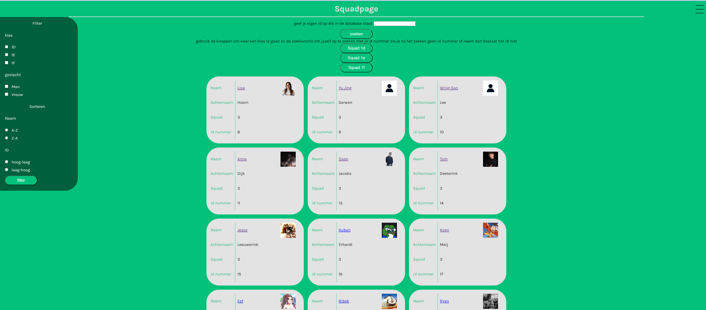

> _Fork_ deze leertaak en ga aan de slag. Onderstaande outline ga je gedurende deze taak in jouw eigen GitHub omgeving
> uitwerken. De instructie vind je in: [docs/INSTRUCTIONS.md](docs/INSTRUCTIONS.md)

# Titel
<h1>squadpage</h1>
<!-- Geef je project een titel en schrijf in één zin wat het is -->

## Inhoudsopgave

* [Beschrijving](#beschrijving)
* [Kenmerken](#kenmerken)
* [Installatie](#installatie)
* [Gebruik](#gebruik)
* [Bronnen](#bronnen)
* [Licentie](#licentie)

## Beschrijving

ik heb een squadpage gemaakt met teamgenoten met daarin eeen zoekfunctie 
en 3 knoppen om naar 3 klassen te gaan

de pagina staat neit meer live omdat ik van cyclicl maar 1 app gratis live kan hebbben

<!-- In de Beschrijving staat hoe je project er uit ziet, hoe het werkt en wat je er mee kan. -->
<!-- Voeg een mooie poster visual toe 📸 -->
<!-- Voeg een link toe naar Github Pages 🌐-->

## Kenmerken

<!-- Bij Kenmerken staat welke technieken zijn gebruikt en hoe. Wat is de HTML structuur? Wat zijn de belangrijkste dingen in CSS? Wat is er met Javascript gedaan en hoe? Misschien heb je een framwork of library gebruikt? -->
<ul>
    <li>node js</li>
    <li>ejs</li>
    <li>express</li>
</ul>

Ik heb een server js aangeleverd gekregen waarin er een app express app 
aangemaakt word met daarin ook de code dat de view engine ejs is en de view engine is simpel gezegd hoe de data aan de gebruiker word weergegeven
 en een
locatie waar de ejs files staan ook word aangegeven dat er gebruik word gemaaak met static van de public map en er zijn get rouets gedefineerd 
waarin er met een fetchjson de code word opgehaald en de data word met response.render weergegeven daarin zit een view dus de index ejs en de options welke data je 
precies wil meegeven die weergeven moet worden 

voor de zoekfucntie heb ik een request.query geberuikt om de zoekopdracht in op te slaan en een variable waar een filter functie aan vast zit zodat de informatie van de student opgehaald word en
daarbinnen zit een for in loop waarin nagelopen word of het opgegeven id overeenkomt met het id van de student klopt het 
dan worden de gegevens van de student getoont klopt dit niet dan word false en return die dat terug in de ejs gebruik ik de code die in respnse.render staat binnen de get route heb ik
gebruik gemaakt van asycn en await omdat je de data moet ophalen met fetchjson en dit is een promise is en ik heb een try and catch toegevoegd 

respsone dat kan code 200 zijn dus dat de response aangekomen is en dit kan ook data zijn in een chat functie dat je een tekstveld invult en 
een request stuurt en dan krijg je meestal data terug uit de server als response
als het 404 is dan is het niet aangekomen en
request is een verzoek aan de server du  een formulier die ingevuld is door iemand en naar de server word gestuurd
redirect is dat je zegt ga naar deze url bijvoorbeel als je drukt 
op submit dat het bericht wat je verstuurt bovenin word weergegeven op dezelfde pagina

## Installatie

[//]: # (<!-- Bij Installatie staat stap-voor-stap beschreven hoe je de development omgeving moet inrichten om aan de repository te kunnen werken. -->)

je drukt op instructuions dan zie je de opdracht en zie je welke stappen ik ondernomen heb om dit te maken

## Gebruik

je drukt op download code en dan kan je ermee gaan werken

## Bronnen

## Licentie

This project is licensed under the terms of the [MIT license](./LICENSE).
